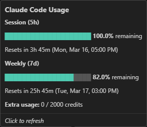

# Claude Code Usage Status - Extension for VS Code

Marketplace: [https://marketplace.visualstudio.com/items?itemName=mhelbich.claude-code-usage-status](https://marketplace.visualstudio.com/items?itemName=mhelbich.claude-code-usage-status)

A simple VS Code extension that shows your [Claude Code](https://claude.ai/code) session and weekly usage directly in the status bar — so you always know how much capacity you have left before hitting a limit.

_Tooltip_:



_Status bar_:


## Features

- **Status bar indicator** — shows remaining usage for the current 5-hour session and the 7-day window, color-coded by how much is left
- **Rich tooltip** — hover to see colored progress bars, exact remaining %, and both relative and absolute reset times
- **Customizable thresholds** — configure when the indicator turns yellow or red
- **Auto-refresh** — polls on a configurable interval (default: every 2 minutes)
- **Click to refresh** — click the status bar item to force an immediate update

### Status bar format

```
⚡ 🟢 S: 82%  │  🟡 W: 38%
```

- `S` = session (5-hour rolling window)
- `W` = weekly (7-day rolling window)
- Percentage = **remaining** capacity
- 🟢 plenty of headroom · 🟡 getting low · 🔴 almost out

### Tooltip

Hovering shows a detailed breakdown with colored progress bars, remaining percentage, and reset times — e.g. "2h 15m (Wed, Mar 19, 02:30 AM)".

## Requirements

You must be logged in to Claude Code (`claude /login`). The extension reads your local credentials file — no API key setup needed.

**Platform support:**

- macOS (reads from Keychain, falls back to `~/.claude/.credentials.json`)
- Linux / WSL (reads from `~/.claude/.credentials.json`)
- Windows (reads from `~/.claude/.credentials.json`)

## Settings

| Setting                              | Default | Description                                 |
| ------------------------------------ | ------- | ------------------------------------------- |
| `claudeUsage.refreshIntervalSeconds` | `120`   | How often (in seconds) to poll usage        |
| `claudeUsage.warningThreshold`       | `60`    | Usage % at which the indicator turns yellow |
| `claudeUsage.dangerThreshold`        | `90`    | Usage % at which the indicator turns red    |

Thresholds are expressed as **used %** (e.g. the default `60` means "warn when 60% has been consumed, i.e. 40% remaining").

## Development

Use the workspace's `Run Extension` or `Watch Extension` launch profile to debug with `F5`. These launch an Extension Development Host, which provides the `vscode` module to the extension at runtime.

### Testing

This extension uses the official VS Code extension test tooling (`@vscode/test-cli` + `@vscode/test-electron`) with Mocha-based integration tests.

- Run unit tests with `npm run test:unit`
- Run extension integration tests with `npm test`
- Debug tests with the workspace's `Extension Tests` launch profile

The test runner downloads VS Code into `.vscode-test/` on first run.

Unit tests cover extracted pure logic such as formatting and rendering helpers. Integration tests cover VS Code-specific wiring, activation, and command behavior.

If `npm test` fails because another VS Code Stable instance is running, either close that instance first or use the `Extension Tests` launch profile from the editor instead.

## How it works

The extension calls the same usage endpoint that Claude Code itself uses (`https://api.anthropic.com/api/oauth/usage`) with the OAuth token stored locally by `claude`. No data ever leaves your machine beyond that single read-only API call.

**Multiple windows:** When more than one VS Code window is open, each instance would otherwise poll independently, quickly exhausting the API rate limit. To avoid this, all instances share a cache file at `~/.claude/usage-cache.json`. Before making a network request, each instance checks whether the cached response is still within its configured refresh interval. If it is, the cached data is used directly and no API call is made. The instance with the shortest configured interval effectively drives the refresh rate for all windows.

## License

MIT
